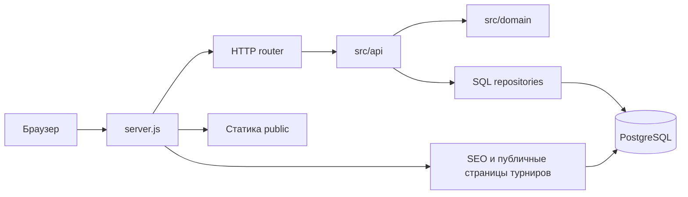

# Карта проекта TGTV

Изучено 17 сентября 2026 года по локальному `main`, коммит `01ef929`
(`feat: release team management update 2.3.2`, 10 сентября 2026).
Это снимок реализации: после изменений соответствующие разделы нужно обновлять.

## Назначение и стек

Сервис для Kill Team: поиск соперника, вызовы, результаты Approved Ops, личные
и командные рейтинги, статистика, All Kill Team Challenge, индивидуальные
и командные турниры, профили команд, уведомления и редактируемая документация.

- Сервер: Node.js >=22, CommonJS, встроенный `node:http`, собственный роутер.
- Хранилище: PostgreSQL; зависимости приложения — `pg` и `markdown-it`.
- Клиент: обычные HTML/CSS/JavaScript, без фреймворка и этапа сборки.
- `package.json` содержит техническую версию `1.0.0`; последний релиз в
  `CHANGELOG.md` — `2.3.2`.

## Путь запроса

`server.js` перед запуском применяет миграции. `/api/*` обслуживает роутер,
остальные запросы сначала проходят через SEO-обработчик, затем через раздачу
статики. В `src/api/routes.js` сейчас 108 маршрутов.

## Где искать код

| Область | Основные файлы |
| --- | --- |
| Запуск, env | `server.js`, `src/config.js`, `.env.example` |
| API: маршруты, доступ, транзакции | `src/api/routes.js`, `src/http/router.js` |
| HTTP: JSON, файлы, ошибки, заголовки, сжатие | `src/http/io.js`, `static.js`, `compression.js`, `seo.js` |
| Регистрация, вход, профиль, сессии | `src/api/auth.js`, `src/domain/passwords.js`, `src/db/repositories/sessions.js` |
| Вызовы и игры | `src/api/challenges.js`, `src/api/games.js`, `src/api/tournament-game-details.js` |
| Очки и рейтинг | `src/domain/scoring.js`, `src/domain/elo.js`, `src/api/rating-replay.js` |
| Индивидуальные турниры | `src/api/tournaments.js`, `src/domain/tournaments/*` |
| Команды и составы | `src/api/player-teams.js`, `src/db/repositories/player-teams.js`, `team-rosters.js` |
| Командные турниры и паринги | `src/api/team-tournaments.js`, `src/domain/team-tournaments.js`, `src/db/repositories/team-matches.js` |
| База и миграции | `src/db/pool.js`, `src/db/migrate.js`, `src/db/migrations/*`, `src/db/rows.js` |
| Основной интерфейс | `public/app.js`, `public/index.html`, `public/styles.css` |
| Административный интерфейс | `public/admin.js`, `src/api/admin.js` |
| Документация и Markdown | `public/documentation.js`, `public/documentation.css`, `src/api/documentation.js`, `src/domain/documentation.js` |
| Локализация и тема | `public/theme-boot.js`, `public/i18n.js`, `public/i18n/{en,ru,glossary}.js`, `docs/i18n-glossary.md` |
| Каталоги игровых данных | `src/domain/kill-teams.js`, `public/game-data.js`, списки в `public/app.js` |
| Уведомления | `src/api/notifications.js`, `src/db/repositories/notifications.js`, функции notifications в `public/app.js` |

## Модель данных и важные правила

- Основные сущности: `users`, `sessions`, `challenges`, `games`,
  `game_participants`, `feedback`.
- Индивидуальные турниры: `tournaments`, `tournament_participants`,
  `tournament_rounds`, `tournament_matches`, `tournament_tables`,
  `tournament_audit_events`.
- Команды: `player_teams`, членство и приглашения, турнирные составы и их
  участники, `tournament_team_matches`, связи `tournament_team_match_games`.
- `games.source_type` различает `challenge`, `tournament_match` и
  `team_match_game`. Турнирный матч и его игра связаны; операции над результатами
  должны сохранять согласованность этих представлений. Для гостей есть
  `game_participants`, поэтому участник игры не всегда является пользователем.
- Транзакцией управляет роутер по `tx: true`. Обработчики и репозитории получают
  один `client`; блокировки `FOR UPDATE` защищают изменяемые строки. Чтение тела
  запроса выполняется до получения соединения из пула.
- В списке 19 миграций с номерами 001–021, номера 008/009 отсутствуют. Применённые
  версии записываются в `schema_migrations`; advisory lock сериализует запуск.
- Пароли хешируются через scrypt. Сессия `sid` живёт в PostgreSQL и cookie;
  срок 14 дней, продление активной сессии обычно не чаще раза в сутки.
  Первый администратор создаётся под advisory lock.
- Approved Ops: `crit + kill + tac + ceil(primary / 2)`, где `primary` —
  выбранная категория очков. Elo: K=32, начальный рейтинг 1000.
- У **игрока** три самостоятельные истории рейтинга: TTS, IRL и combined.
  Combined пересчитывается по своей Elo-истории. У **команды** combined
  вычисляется как `rating_tts + rating_irl - 1000`.
- Форматы индивидуальных турниров: Swiss и single elimination. Текущая
  валидация elimination требует ровно 8, 16, 32 или 64 участника.
- Командный турнир: Swiss, составы по три игрока, Shield/Sword, ролл-офф,
  баны миссий, выбор столов и миссий. Реализованные правила описаны в
  [team-pairing-rules.md](team-pairing-rules.md); это адаптация для 3×3.
- Вкладка «Составы» командного турнира доступна всем, включая гостей: видны
  названия составов, игроки, капитаны и статусы. Киллтимы раскрываются после
  фактического запуска первого раунда (active/completed); закрытие регистрации,
  подготовка первого раунда их не раскрывает.
  Это правило действует и в профиле команды, и для индивидуальных участников.
  До раунда администратор видит все киллтимы, капитан, руководитель команды
  и каждый текущий игрок состава — весь свой состав с киллтимами. Удаление/отзыв состава после старта должно
  сохранять сыгранные результаты и рейтинги.
- Запуск турнира разделён на два шага для individual и team. После закрытия
  регистрации `Generate first round` открывает настройку миссий, столов и пар.
  Сохранение оставляет турнир `registration_closed`, раунд `not_ready`,
  `startedAt = null`: пары уже видны, но игр и уведомлений ещё нет.
  `Edit first round` открывает сохранённые настройки для повторного редактирования.
  Отдельный `Start tournament` активирует этот же первый раунд и его пары,
  раскрывает киллтимы, создаёт индивидуальные игры и уведомление о старте всем
  участникам, разрешает капитанский паринг и ввод результатов. Сервер проверяет
  статус турнира для этих действий. Повторное открытие регистрации, изменение
  участников/составов/посева, формата или столов сбрасывает подготовленный раунд.
  Последующие раунды сохраняют прежний порядок генерации. Новая миграция не нужна.
  Отдельная кнопка Preview pairings и её API удалены. Просмотр и изменение пар
  выполняются в окне Generate/Edit round; `rounds/next/preview` и общий алгоритм
  построения раунда используются этим окном.

## Как устроен клиент

`public/app.js` — основной файл примерно на 8,8 тыс. строк: общий `state`,
API-запросы через `api()`, HTML-шаблоны, функции `render*` и привязка обработчиков
через `wire*`. Навигация сочетает hash-маршруты и History API; публичные адреса
турниров и команд обрабатываются отдельно.

- `admin.js` загружается после подтверждения прав через `/api/me`.
- `documentation.js` и его CSS загружаются при открытии документации.
- `theme-boot.js` выставляет тему/язык до первой отрисовки; словарь второго
  языка загружается при переключении. Новые тексты нужно учитывать в RU и EN.
- Паринги обновляются опросом примерно каждые 5 секунд, уведомления — 30 секунд.
  При изменении форм важно сохранять незавершённый ввод во время обновлений.
- Общий поиск игроков: `data-user-search`, `wireComboFields`, `userComboItems`,
  `syncUserSelect`; идентификаторы и допуски игроков важнее отображаемого имени.
- `styles.css`: токены тёмной/светлой темы, компоненты и медиазапросы.
  Результаты проверки повторов: [CSS-аудит](css-audit-2026-09-17.md).

## Ограничения, которые важно помнить при изменениях

1. При выпуске изменённых ассетов синхронно обновлять `?v=` в
   `public/index.html` и `ASSET_VERSION` в `src/http/seo.js`.
   Они обслуживают разные точки входа в интерфейс; согласованность покрыта тестом.
2. Аватары и PDF правил хранятся в БД, но отдаются отдельными файловыми API с
   ETag и версией в URL. Не возвращать их крупными data URL в обычных JSON-ответах.
3. PDF правил ограничен 2 MiB, логотип 1 MiB, тело редактирования турнира — 5 MiB
   с учётом base64. Пределы клиента, сервера и reverse proxy должны согласовываться.
4. Опубликованная документация хранится в `documentation_pages`.
   `docs/documentation/*` служит начальным наполнением миграции 018;
   редактирование этих файлов само по себе не обновляет уже заполненную БД.
5. Архивные планы в `docs/superpowers/` и отдельные технические задания не
   доказывают, что функция реализована. Проверять код и тесты.
6. Существующие 36 изменений Git после checkout — окончания строк:
   `git diff --ignore-space-at-eol --stat` пуст. Не смешивать их с будущими правками.

## Локальный запуск и проверка

Нужны Node.js >=22 и PostgreSQL (compose использует PostgreSQL 16).
Скопировать `.env.example` в `.env`, согласовать `DB_PASSWORD`, `DB_PORT`
и `DATABASE_URL`; для локального HTTP оставить `COOKIE_SECURE=false`.
Команды: `docker compose up -d`, `npm ci`, `npm start`.
Адрес по умолчанию: `http://127.0.0.1:3000`.

- `npm run test:unit` — тесты без PostgreSQL.
- `npm run test:integration` — отдельная тестовая БД и `TEST_DATABASE_URL`.
  Хелпер очищает таблицы через TRUNCATE; URL должен указывать именно на тестовую БД.
- `npm test` — обе группы. В репозитории 40 файлов unit-тестов и 18 integration.
- `npm run verify:migration:canonical-games` — проверки согласованности
  канонических турнирных игр после миграции/выкладки.

Проверено 17 сентября: зависимости установлены через `npm ci`, все 340
unit-тестов прошли. Интеграционные тесты и запуск с БД не выполнялись:
`.env` отсутствует, команда Docker недоступна в текущем окружении.
Исходный код и стили в ходе изучения не изменялись.

### Обновление локального окружения после изучения

По просьбе пользователя 17 сентября развёрнут постоянный локальный стенд:
PostgreSQL 16.15 из Windows-бинарников в `work/local-runtime/pgsql`, кластер
в `data/local-postgres`, порт `127.0.0.1:55432`. Приложение работает на
`http://127.0.0.1:3000` с `.env` и базой `tgtv_local_demo`; отдельная
`tgtv_local_test` используется автотестами. Docker не требуется.

Созданы 100 аккаунтов (один администратор `admin`, 99 игроков) и 20 команд
по три случайных разных игрока: 60 участников, 40 аккаунтов без команды.
Скрипты управления и наполнения: `scripts/start-local.ps1`,
`scripts/stop-local.ps1`, `scripts/seed-local-demo.js`.
Детали и расположение учётных данных: [local-development.md](local-development.md).
Все 564 теста прошли; проверены HTTP API, вход, повторный seed и перезапуск
с сохранением данных. Основной код приложения и схема не изменены.

## Требования к будущим справочникам Approved Ops и сезонов

Статус: отложено по просьбе пользователя; сохранить как заметки для будущей задачи.
Уточнено пользователем после изучения проекта. Это целевая модель, пока не
реализованная в коде или БД. Пользователь сообщил о скором выходе нового
Approved Ops; дата, состав миссий и изменения правил ещё не уточнялись.

- Основная сущность — **набор Approved Ops**, внутри которого находятся
  принадлежащие ему списки Tac Ops и Crit Ops. Предлагаемые таблицы:
  `approved_ops_sets`, `tac_ops`, `crit_ops`; обе таблицы операций имеют
  `approved_ops_set_id`. Это заменяет прежнее предложение общего Mission Pack.
- **Сезон — независимый тег для группировки статистики**, а не версия правил
  или источник доступных операций. Связь сезона с набором по умолчанию не нужна.
  Один набор может использоваться в разных сезонах; один сезон может включать
  игры разных наборов. Календарные даты не являются обязательной частью тега.
- Для перехода нужны одновременно существующие старый и новый наборы.
  Новый выпуск добавляется отдельной записью со своими операциями; изменение
  набора по умолчанию для новых игр не должно менять существующие игры и турниры.
- Игра должна сохранять выбранный набор и ссылки на его операции; название
  операции не является её идентификатором. Совпадающие названия в разных
  наборах допустимы. Сезон фиксируется отдельно; миграция должна сохранить
  существующее распределение статистики перед отказом от определения по дате.
- Старый набор остаётся доступным для просмотра, подтверждения и исправления
  исторических результатов. Сервер проверяет результат по набору самой игры,
  а не по глобальному текущему списку. Смена названий не должна разрывать историю.
- При миграции нынешние справочники становятся первым набором; существующие
  результаты и незавершённые паринги сохраняются. Не выдумывать состав нового
  выпуска и не обновлять исторические миграции под изменяемые справочники.
- При реализации проверить места, зависящие от текущего состава операций:
  формы результата, статистику, glossary-тесты, генерацию и баны Crit Ops в
  командном паринге. Хранение набора в БД само по себе не обеспечивает поддержку
  возможных новых формул очков или правил паринга; их уточнить по новому выпуску.
